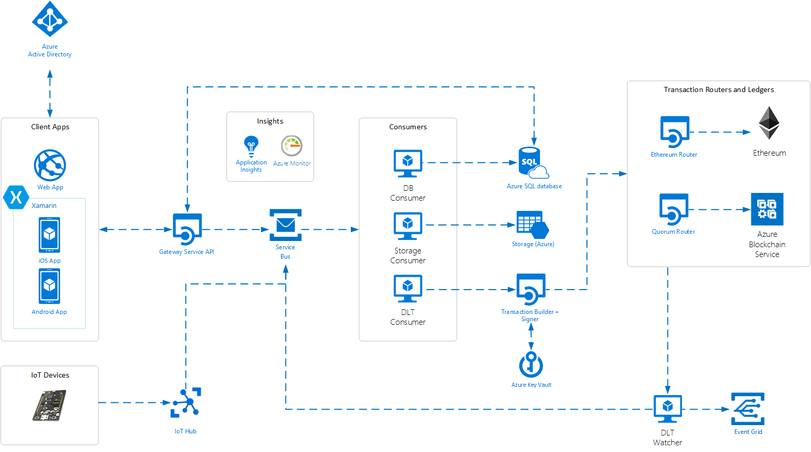

# Azure-Blockchain-Workbench
azure blockchain workbench test proof of concept setup
# Why  Azure Blockchain Workbench ?
Azure Blockchain Workbench, is a framework and accelerator for implementing blockchain. Workbench uses Ethereum Proof of Authority which optimizes transaction verification and eliminates the resource and performance overhead of mining.

# Architecture Azure Blockchain Workbench

# Préparation du déploiement

# Configuration Azure AD

