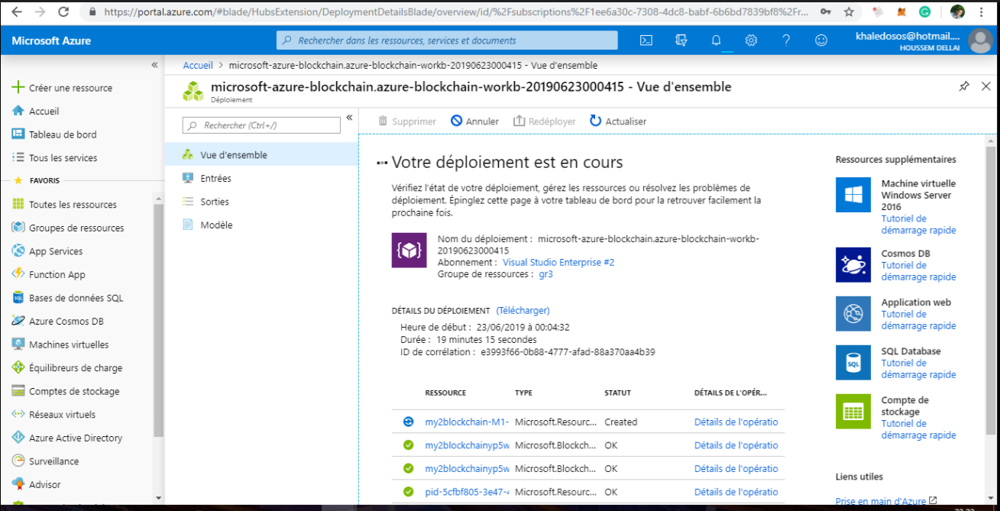
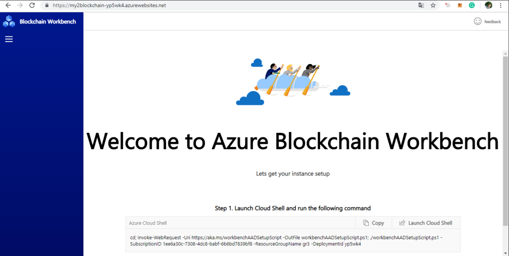

# Azure-Blockchain-Workbench
azure blockchain workbench test proof of concept setup
# Why  Azure Blockchain Workbench ?
Azure Blockchain Workbench, is a framework and accelerator for implementing blockchain. Workbench uses Ethereum Proof of Authority which optimizes transaction verification and eliminates the resource and performance overhead of mining.
Prerequisites:
Azure Active Directory users in the tenant associated with Blockchain Workbench. For more information, see [add Azure AD users in Azure Blockchain Workbench!](https://docs.microsoft.com/en-us/azure/blockchain/workbench/manage-users#add-azure-ad-users).

# Architecture Azure Blockchain Workbench

# Préparation du déploiement

# Configuration Azure Active Directory 
Azure AD must be configured to complete your Azure Blockchain Workbench deployment. You will use a PowerShell script to perform the configuration.

The authenticated user requires permissions to create Azure AD application registrations and grant delegated application permissions
using Azure Cloud Shell.

# New Azure Blockchain Workbench application:
Create a smart contract code then upload the SOL and JSON files and add members to the blockchain application

# Using applications in Azure Blockchain Workbench

